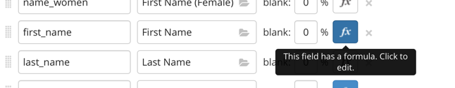
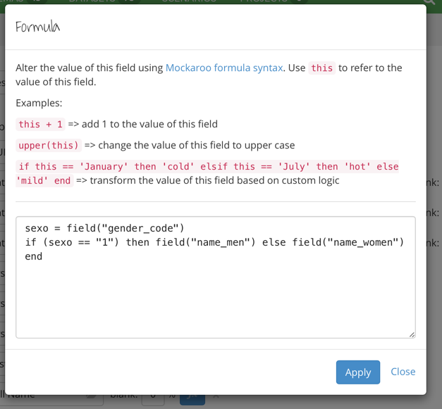
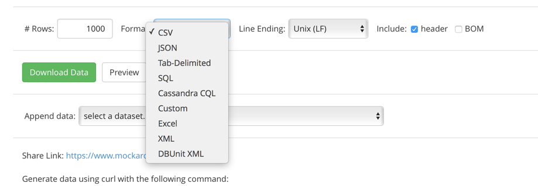

## Mockaroo

Mockaroo (www.mockaroo.com) is a freemium tool that provides mock data.

Almost kind of data could be mocked with Mockaroo.

Also, it allows that csv could be uploaded to fill some of this data.

Mockaroo allows embedded objets.

This is a very light tutorial of Mockaroo, and it is for developers that does not know Ruby, like me.

#### Schema
First of all, you should create the schema within its website.

Or you can create the json file to load to Mockaroo. The json has the following sintaxis:


```json
{
  "num_rows": 1,
  "file_format": "json",
  "name": "MY_ELEMENT",
  "array": true,
  "columns": [
    {
      "name": "_id",
      "type": "MongoDB ObjectID",
      "formula": ""
    },
    {
      "name": "ID_PERSON",
      "type": "Regular Expression",
      "value": "\\d{8}",
      "formula": ""
    },
    {
      "name": "ID_GENDER",
      "type": "Dataset Column",
      "dataset": "gender",
      "column": "ID_GENDER",
      "selectionStyle": "random",
      "formula": ""
    },
    {
      "name": "N_GENDER",
      "type": "Dataset Column",
      "dataset": "gender",
      "column": "N_GENDER",
      "selectionStyle": null,
      "formula": ""
    }
   ]
}
```

#### How to add "intelligent" to our data
Almost of kind of data can be simulated in Mockaroo, but some of the cannot be simulated, or they have some restrictions that cannot be done without a little programming.

For that can be used the formula field:




These formula fields have to be programming in Ruby.





Bellow, there are a bunch of funtions that are usually used with Mockaroo:

**1.) Get the timestamp from a date**

```ruby
my_date = field('ANALISYS_DATE')
my_date.to_time.to_i
```

**2.) Sort data**
The field *MEDICAL_REVISIONS* is an array of elements, one of field of this element is *ANALISYS_DATE*. For sorting by this field:

```ruby
revisions_list = field('MEDICAL_REVISIONS')
revisions_list.sort_by { |element| element['ANALISYS_DATE'].to_i }
```

**3.) Convert a date to another format**

```ruby
birth_dateFormated = birth_date.strftime("%FT%TZ")
```

**4.) Add days to a date**

```ruby
a_few_days = random(1, 10)
my_date_with_few_days_more = field('MY_DATE') + days(a_few_days)
```

**5.) Concat elements**

```ruby
prefix = "https://randomuser.me/portraits/"
sufix = ".jpg"
gender_code = field("ID_GENDER")
if (gender_code == "1") then path = "men" else path = "women" end
id = random(1, 99)
concat(prefix, path, "/", id, sufix)
```

**6.) Get the last element from an array of elements**

```ruby
last_element = field('MEDICAL_REVISIONS').last
imc_from_last_element = last_element['IMC']
```

**7.) Get the last element from an array of elements that is ordered by a field**

```ruby
revisions = field('MEDICAL_REVISIONS')
sortedRevisions = revisions.sort_by { |element| element['ANALISYS_DATE'].to_i }
lastRevision = sortedRevisions.last
lastRevision['TAD']
```

**8.) Checking the length of a field value**

```ruby
if field('RESTRITION').length >0 then 'Yes' else 'No' end
```

**9.) A well formed NIF (Spanish ID) or NIE (Spanish ID for non European Union Residents)**

```ruby
letters = "TRWAGMYFPDXBNJZSQVHLCKET"
lettersNIE = "XYZ"

if (field('DOCUMENT_TYPE') == 'NIE') 
then 
	id = this[1..-1] 
else 
	id = this 
end

if (field('DOCUMENT_TYPE') == 'NIE') 
then 
	positionNIE = id.to_i % 3 
end

if (field('DOCUMENT_TYPE') == 'NIE') 
then 
	letterNIE = concat(lettersNIE[positionNIE],'-') 
else 
	letterNIE = '' 
end
	
position = id.to_i % 23

lastLetter = letters[position]

concat(letterNIE, id, '-', lastLetter)
```

#### Mock data
When the schema is built, it is time to download the mock data.

It can be downloaded in a good bunch of formats:




